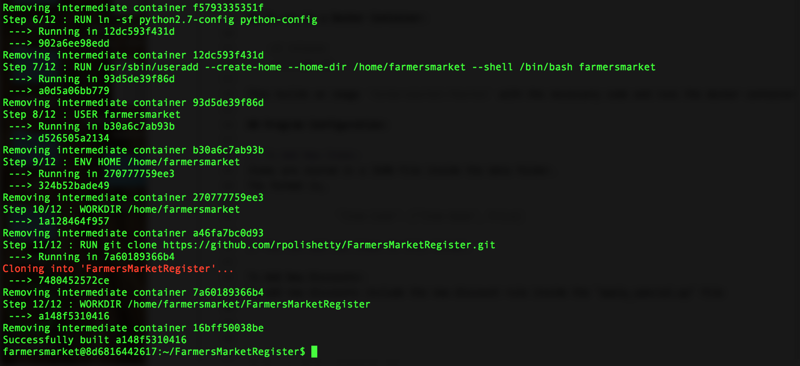

# Farmers Market Register

Written by Rohith Polishetty

## Program Usage:

	python2.7 ./main.py

## To run in a Docker Container:
    
    cd release
    ./script.sh
    
This builds an image `farmersmarket:fmarket` with the necessary code and runs the docker container named `register` as an interactive session. A screenshot is attached.

    
## Program Configuration:

1. To Add New Items:
Items are stored in a JSON file inside the data folder. 
The format is,

		"Item Code": ["Item Name", Price]

2. You can add new items in this format.

To Add New Discounts:
To add new discounts include the new discount rule inside the "apply_special.py" file

## For Applying Multiple Discounts 
1. Set flag = True in "flag.json" file
2. If flag = False only the latest discount is applied

